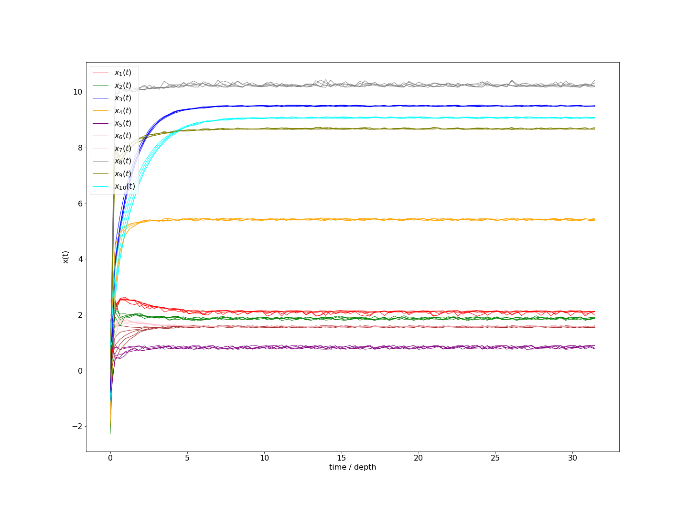
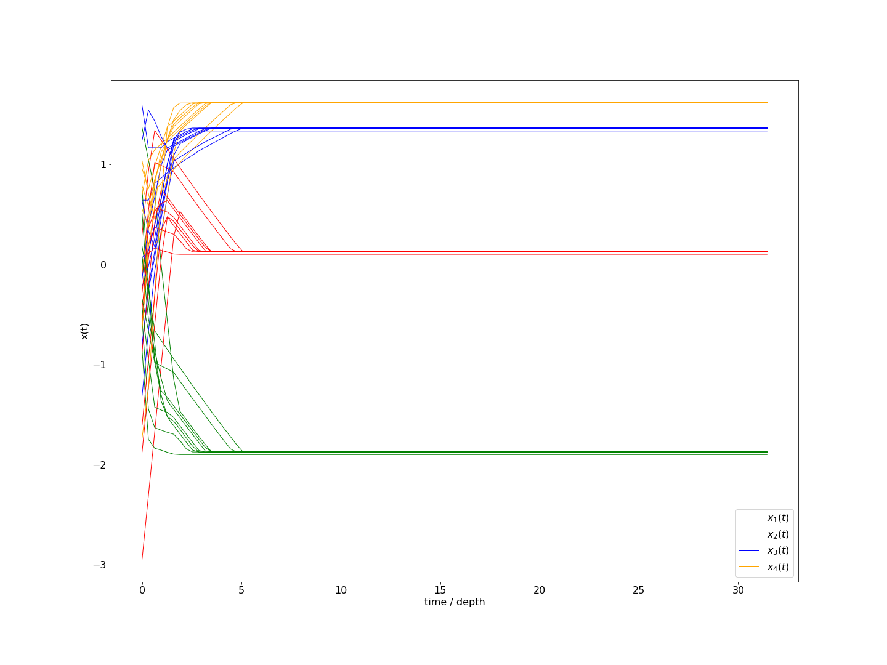

# RNN-for-Optimization-Problems
This project contains my work that target on solving some problems of convex programming and nonconvex programming by using Recurrent Neural Network

## Installation 

Install my-project

```python 
  $ pip install -r requirements.txt
```
## Test
Open and run file `main.ipynb`

## Results
- Transient behavior of neural network with 10 different initial points in problem 1

- Transient behavior of neural network with 10 different initial points in problem 2

